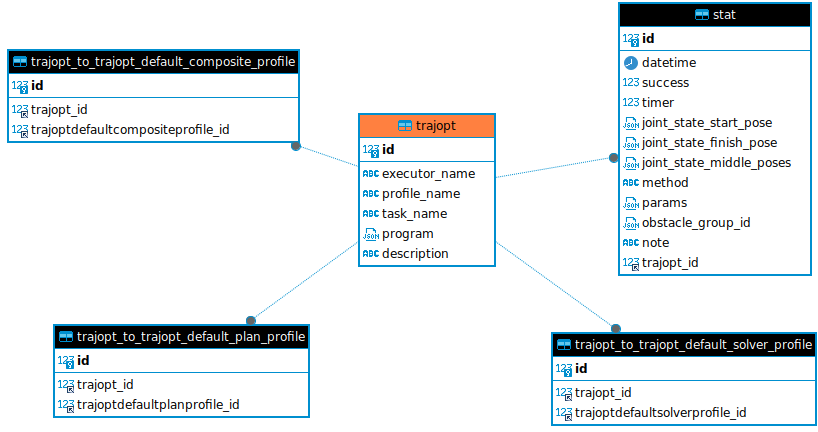
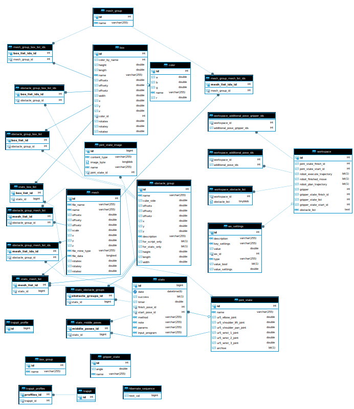

## API для работы со статистикой для UR5

Функции приложения:
- управление конфигурациями планировщиков (trajopt и т.д.) - частично сделано;
- сбор информации о работе планировщиков - частично сделано;
- обработка статистики - в планах на будущее.

Для разворачивания нужен доступ к проекту https://github.com/allicen/UR5_Trajopt_UI (закрытый доступ) 
и https://github.com/allicen/UR5_TrajOpt (открытый доступ).

Необходимо запустить UR5_TrajOpt (ROS-проект для работы с роботом-манипулятором) и UR5_Trajopt_UI (Web-интерфейс).

**Собранный Web-интерфейс (Spring Boot + Angular) можно скачать по адресу**:
https://drive.google.com/file/d/1AnwJGNhj6uua7u2KFvocLAmMKpnI0DX-/view?usp=sharing.

Важно! В собранном проекте по ссылке используется встроенная база данных H2, которая хранит данные в локальном файле.
Для работы необходима **Java от 11 версии** (но, скорее всего, запустится и от 8 версии).

--------------

Видео работы всего проекта: https://www.youtube.com/watch?v=5Q86EpBCiL4

---------------

Структура всего проекта:
- ROS Noetic (C++, Python);
- Spring Boot (Java);
- Angular (Typescript);
- Django (Python);
- База данных Mysql (2 базы).

Для разворачивания ROS-окружения используется Docker.

**Схема БД**

1) Для хранения статистики:



2) Для всего остального:




#### Команды для работы с проектом

Создать миграции

```
python3 manage.py makemigrations
```

```
python3 manage.py migrate stats --database=default
```